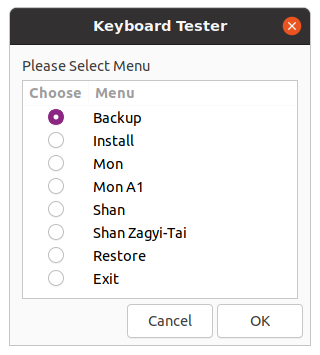

# keyboard-test
Keyboard Tester Duct-Tape Script


### Command Option

```
./keyboard-test.sh 

Usage: ./keyboard-test.sh {bur|zawgyi|mnw|mnwa1|shn|zgt|install|backup|restore|menu}

 install                           # Backup and Replace Keyboard File

 bur | zawgyi | mnw | mnwa1 | shn | zgt  # Its support keyboard layout

 backup | restore                  # Its keyboard file backup and restore

 menu                              # Its GUI Menu

```

### GUI Mode


